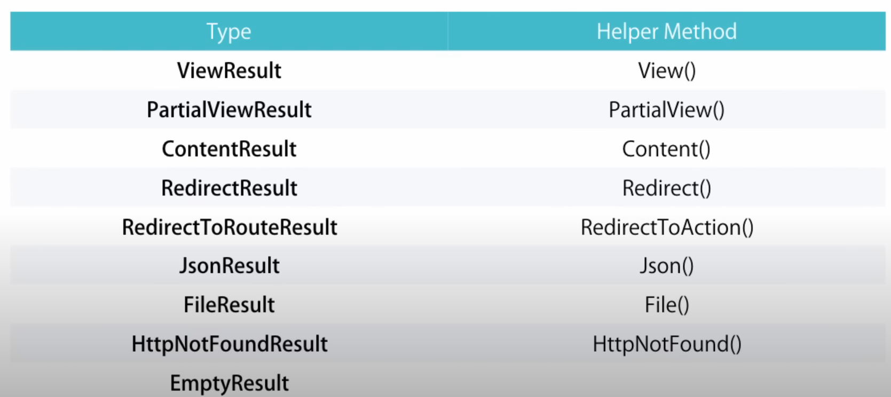

Notes of this [tutorial](https://www.youtube.com/watch?v=E7Voso411Vs&ab_channel=ProgrammingwithMosh)

# ASP.NET MVC Architecture

MVC stands for Model-View-Controller and it is an architectural pattern to implement user interfaces.

Model: application data and behaviour in terms of its problem domain and independent of the UI. For example, in the movie application, the domain model will consists of classes like Movie, Customer, Rental and Transaction.

View: The HTML markup that we display to the user.

Controller: Responsible for handling an HTTP Request.

For example when the url http://vidly.com/movies is opened the controller gets all the movies from the model and displays them in the view.

With this architecture there is a better separation of concerns and mantainability.

The Router selects the right controller to handle a request.

# Setting up the development environment

Visual Studio -> tools -> extensions and updates... -> online -> search for "Visual Studio Productivity Power Tools". Search also for "Web essentials" and also install ReSharper.

# Create the First ASP.NET App

In the installer of the Visual Studio there is a checkbox for ".net framework 4.8 compatibility package". Also search for ".NET Framework project and item templates " and mark the checkbox.

File -> New -> Project -> Templates -> Visual C# -> Web -> ASP.NET Web Application. Name: Vidly, select location, check "create directory for solution" and check "add to source control". In the list of templates select MVC and make sure "Host in the cloud" is not selected. Select "Ok". Select "Git".

In RouteConfig we have the configuration for the Routing.

# MVC in action

Solution explorer -> right click in Models/ -> Add -> Class... (name: Movie)

TIP: to quickly write a property in a clase type "prop" and press the tab keyword -> specify the type -> press tab again -> specify the name.

Solution explorer -> right click in Controllers/ -> Add -> Controller... -> MVC 5 Controller - Empty (name: MoviesController).

Solution explorer -> Views/ -> Movies/ -> right click -> Add -> View... (name: Random) -> Template empty -> uncheck "Create as a partial view" (it is like a widget to reuse in different views). -> 
check "use a layout page" (a layout page is a template or a master page) -> select Views/Shared/_Layout.cshtml -> Add.

Being in the Random.cshtml page press Ctrl+F5 to run the app and the app will be started in the /Random page.

If you get "connection is not private" error on chrome go to chrome://flags/ and enable "Allow invalid certificates for resources loaded from localhost."

# Adding a theme

Our ASP.NET MVC app uses Bootstrap as its frontend css framework so we need to find a bootstrap template. 
Go to bootswatch.com and under Themes select Lumen. Under Lumen select bootstrap.css. Download the file 
and call it bootstrap-lumen.css and add it in the project under the Content/ folder. Replace the reference 
to bootstrap.css to bootstrap-lumen.css. Open App_Start/BundleConfig.cs and change the reference. Compile the project 
to see the changes using Ctrl+F5 since we changed our C# code.

# Action Results

Our MoviesController returns ActionResult, this is our base class for all ActionResults.

Types of ActionResults:



Content is for returning text only (return Content("Hello World")).

HttpNotFound is for the standard 404 error.

EmptyResult is to return an empty page.

RedirectToAction(nameOfTheAction, controller, arguments) (example: return RedirectToAction("Index", "Home", new { page = 1, sortBy = "name" });) 

TIP: Build the application with Ctrl+Shift+B to prevent openning a new tab and refresh your current tab to see the changes.

# Action Parameters

```c#
public ActionResult Edit(int id)
{
    return Content("id=" + id);
}
```

Access movies/edit/1 or movies/edit?id=1 to access that content.

TIP: Rename a parameter pressing f2 so all references are renamed automatically.

Open App_Start/RouteConfig.cs in the solution explorer to check the default router.

# Convention-based Routing

In App_Start/RouteConfig.cs before the default routes you can place your custom routes. You must define your routes from most specific to more generic.

TIP: type "mvcaction4" and press the tab keyword to create an action.

You can also specify constraints to the routes.

```c#
routes.MapRoute(
    name: "MoviesByReleaseDate",
    url: "movies/released/{year}/{month}",
    defaults: new { controller = "Movies", action = "ByReleaseDate" },
    constraints: new { year = @"\d{4}", month = @"\d{2}" }
);
```

This is the old way of defining custom routes

# Attribute Routing

Put "routes.MapMvcAttributeRoutes();" in App_Start/RouteConfig.cs and above the ActionResult definition in the Controller put the custom route with the following syntax:

```c#
[Route("movies/released/{year}/{month:regex(\\d{2}):range(1, 12)}")]
public ActionResult ByReleaseDate(int year, int month)
{
    return Content(year + "/" + month);
}
```

This is the better way of defining custom routes because you don't need magic strings to reference the routes.

Another constraints for the custom routes are min, max, minlength, maxlength, int, float and guid.

# Passing data to the views

Every controller has a parameter called ViewData of type ViewDataDictionary. For example we can pass the Movie to the view doing:

```c#
ViewData["Movie"] = movie;
```

This is not the best way because it depends on magic strings and the parameter needs casting on the View making it an ugly code to write. The same happens with ViewBag. Instead you should pass data to the views using the approach explained before.

# View Models

If we wanted to pass the customers and the movies to the random view we couldn't because we only have one model. To solve that we will a View Model, it is a model for an specific view.

Solution explorer -> Right click on Vidly/ -> Add -> new folder "ViewModels" -> Add a new class inside that folder called RandomMovieViewModel. Then you can use that class to pass data to the view.

# Razor Views

Razor views allows to mix html code and c# code in the view file. For example:

```c#
@if (Model.Customers.Count == 0)
{
    <p>No one has rented this movie yet.</p>
}
else
{
    <h3>Customers who have rented this movie:</h3>
    <ul>
        @foreach (var customer in Model.Customers)
        {
            <li>@customer.Name</li>
        }
    </ul>
}
```

# Partial Views

Solution explorer -> Views/ -> Shared/ -> _Layout.cshtml (this is the template for our app). We can extract the navigation bar to a partial view.

Partial view names are prefixed with an underscore.

Solution explorer -> Right click on Shared/ -> Add -> View... (name: _NavBar, check "create as a partial view") -> Paste the nav content on the template in that new file.

Reference that file in the template using:

```c#
@Html.Partial("_NavBar")
```

# Exercise

- Change the app name to "Vidly".
- The nav has only two links "Customers" and "Movies".
- In the Customers page we have a table with the list of Customers (hardcoded in the action).
- When clicking on a customers name you are redirected to Customers/Details/id and you can see the customers name. (if the user id doesn't exist show 404 error).
- In the Customers page if we don't have customers we should see a message "We don't have any customers yet.".
- The list of movies is very similar but without the link.