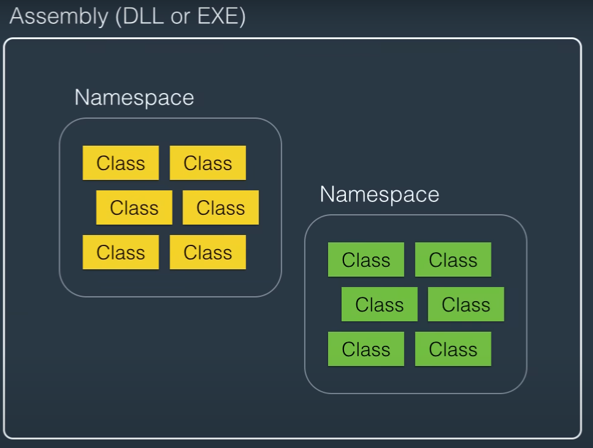
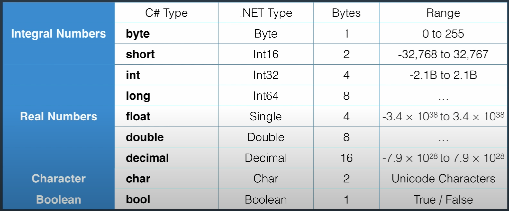
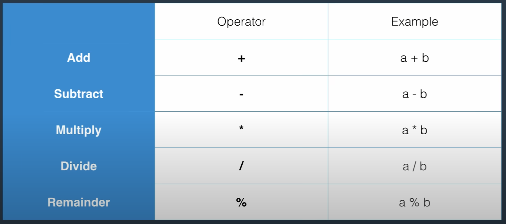
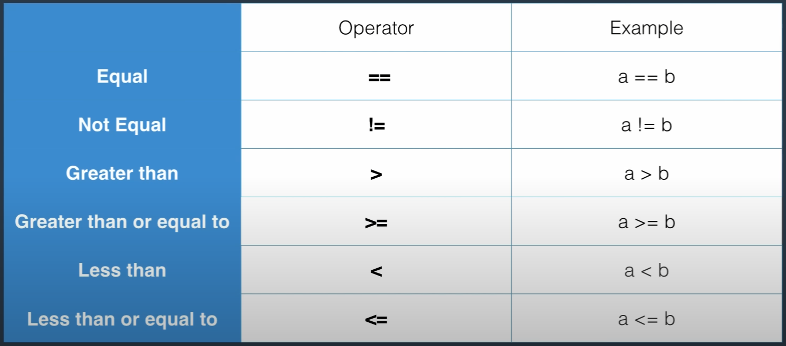
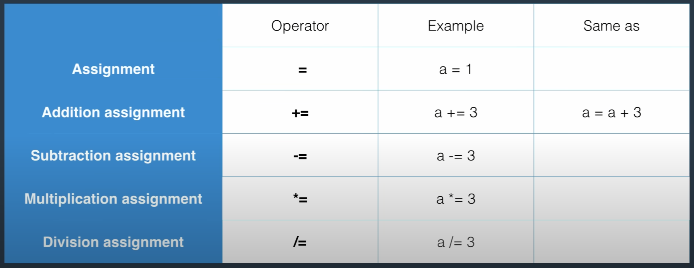
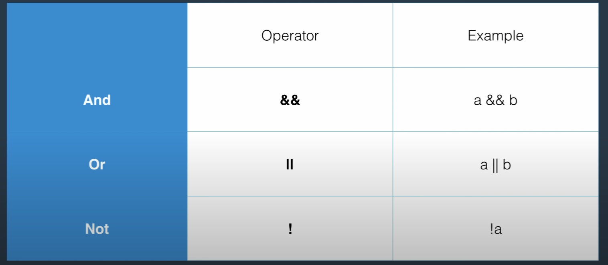
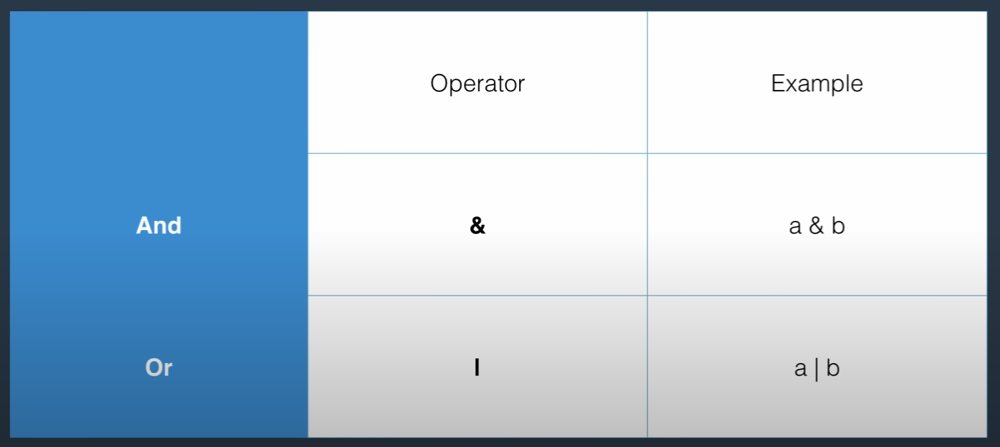

C# Tutorial For Beginners - Learn C# Basics. This is the [tutorial](https://www.youtube.com/watch?v=gfkTfcpWqAY&t=137s&ab_channel=ProgrammingwithMosh)

# C# vs .NET

C# is a programming language and .NET is a framework for building applications on Windows. .NET is not limited to C#.

.NET consists of two components: CLR (Common Language Runtime) and Class library.

# CLR

CLR is an application that is sitting on the memory whose job is to translate the IL code (Intermediate Language code) to the machine code. This process is called Just-in-time compilation (JIT).

# Architecture of .NET applications.

At the top level the application consists of building blocks called Classes. To organize the classes we use namespaces, which are the containers for related classes. An Assemply (DLL or EXE) is a container for related namespaces.



When compiling an app the compiler builds one or more assemblies depending on how you partition your code.

# Your first C# application

File -> new -> project -> templates -> windows -> console application -> name: "HellowWorld" -> solution name is for when you have more projects.

Console applications are simple apps that don't have an user interface.

view -> solution explorer.

Properties/AssemblyInfo.cs: info of the assembly.

References/: list of assemblies used in the project.

App.config: xml where we store the configuration for the application.

Program.cs: where we write our code.

To use a class that is written in another namespace we have to import it using the "using" statement.

The Main method is where the app starts.

Console is a class used to show information on the screen. By using Console.WriteLine(""); we can write something.

TIP: Run an app with Ctrl + F5

# Variables and Constants

Variable: a name given to a storage location in memory.

Constant: an immutable value.

```c#
int number; //data type + identifier
int Number = 1;
const float Pi = 3.14f;
```

For local variables use camel case notation and for constants use pascal case.

Primitive types:



Non-primitive types: String, Array, Enum and Class.

# Overflowing

```c#
byte number = 255;
number = number + 1; //0
```

In C# if we want to stop overflowing we have to use the "checked" keyword. With this code an exception will be thrown and overflow will not happen.

```c#
checked {
    byte number = 255;
    number = number + 1; //0
}
```

# Scope

Scope is where a variable or constant has meaning.

# Demo of variables and constants

TIP: Compile an app with Ctrl+Shift+B

TIP: code snippet to write Console.WriteLine() faster is to write cw and press the tab keyword.

By simply writing "var" before the identifier we don't have to explicit the data type.

Format string: string that can be used as a template.

```c#
Console.WriteLine("{0} {1}", byte.MinValue, byte.MaxValue);
```

# Type conversion

Implicit type conversion:

```c#
byte b = 1;
int i = b;
```

When we copy a byte to int we only have to place zeros before the byte so it won't have data loss.

Explicit type conversion (casting): tell the compiler that we are sure that we want the data loss.

```c#
int i = 1;
byte b = (byte)i;
```

We are going to loss some data because byte has less info than int but we tell the compiler that we are aware of.

Conversion between non-compatible types: we have to use the Convert class or the Parse method

```c#
string s = "1";
int i = Convert.ToInt32(s);
int j = int.Parse(s);
```

# Demo of type conversion

Exception handling:

TIP: code snippet for writing the try-catch bloc is to write "try" and press the tab keyword.

```c#
try {
    var number = "1234";
    byte b = Convert.ToByte(number);
} catch (Exception) {
    Console.WriteLine("The number could not be converted to a byte")
}
```

If the try code block throws an exception the catch block will be executed.

# Operators

We have 5 types of operators: Arithmetic, comparison, assignment, logical and bitwise.

Arithmetic operators:



We also have the increment and decrement operators which are shortcuts for adding or substracting 1 to a variable.
- Increment: a++.
- Decrement: a--.

```c#
// Postfix increment
int a = 1;
int b = a++; //a=2, b=1 (first we assign the value to the b variable and then we increment it).

// Prefix increment
int a = 1;
int b = ++a; //a=2, b=2 (first we increment the value and then we assign it to the b variable).
```

Comparison operators:



Assignment operators:



Logical operators:



Bitwise operators: are used in low level programming.

