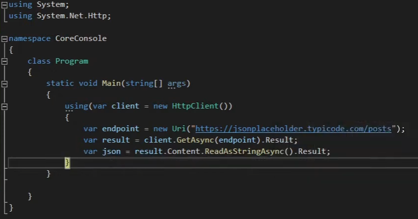

Notes on this [tutorial](https://www.youtube.com/watch?v=Yi-O-HBGPeU&ab_channel=NickProud)

You can put a breakpoint in the curly braces after the json variable so you can see the json generated and check its fields.

For creating an http post you will have to install the nugget package of JsonConvert.

