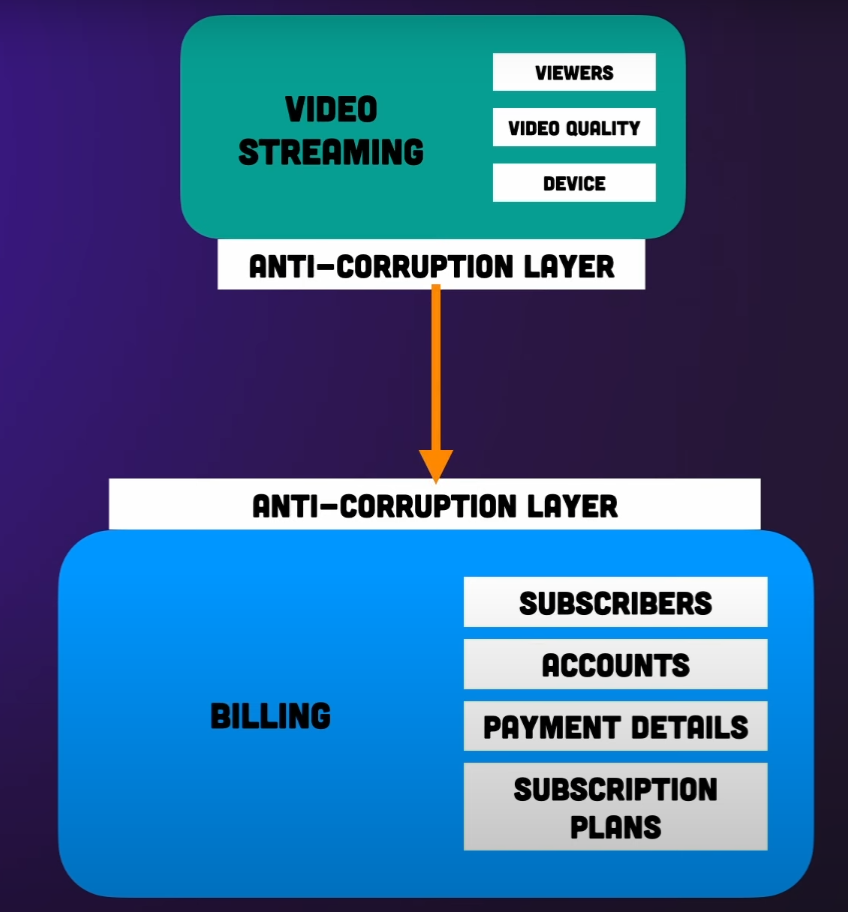
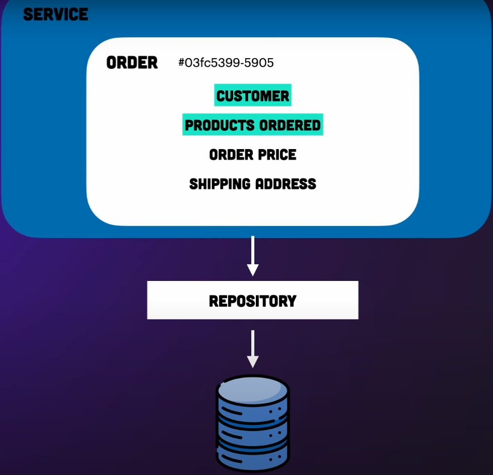

# What you need to kwnow

Notes on this [video](https://www.youtube.com/watch?v=4rhzdZIDX_k&ab_channel=AlexHyett) about Domain Driven Design (DDD) and also about this [video](https://www.youtube.com/watch?v=kqIpW2FQl6Y&ab_channel=ASP.NETMVC) on how to implement DDD in ASP.NET.

Book: Domain-Driven Design by Eric Evans.

DDD is a design approach that emphasizes understanding the business domain and using that understanding to guide the design of the software application. The goal of DDD is to create a software system that models the domain accurately and is easy to understand and maintain.

## Strategic design

It is easier to start doing it from scratch rather than changing an existing app.

A domain refers to the subject area in which we are building an application.

## Ubiquitous language

It is important that everyone is using the same language. You want that the words used to describe the objects in your application to be the same ones that are used by the business.

For example, if we wanted to build Netflix from scratch using DDD we would have the following subdomains: video streaming (this would be a core domain), recommendations and billing.

Defining the domains should be a team work with the business people (not developers alone).

The aim is to end up with a system that represents the real world domain that you are trying to solve. This is an iterative process, you may find that one domain is huge and should be divided in various sub domains.

The next part is to define the key parts of each domain. For example, inside billing we can have customers, accounts, payment details and subscription plans. Some concepts may be part of more than one domain, for example the customers in the billing domain are also present in the video streaming domain (they are called viewers in that domain) and also in the recommendations domain.

## Bounded context

Each sub domain will have its own bounded context allowing the language to be different for each sub domain. Make sure each domain has some unique concepts.

Example:
- Video streaming: viewers, video quality, device...
- Recommendations: user, favourites, history...
- Billing: customers, accounts, payment details, subscription plans...

The aim here is to build up a model of all the different elements that make up each of the domains. These elements are called entities.

## Context mapping

This is about the relationship between the different elements.

The context maps defines which domains communicates with which ones, how they communicate and the direction in which they communicate. The interaction between the domains will happen between their entities.

In the Netflix example, the video streaming domain will need to know the video quality and for that it needs to know what subscription plan the user has which is in the billing domain. In this case there is a mapper between this two domains.

## Anti-corruption layer

We have to make sure that, by creating the mapper, we don't polute either of the domains with information that there doesn't need to be there. The anti-corruption layer makes the translation.

## Tactical design

In this stage we try to define the models a little bit further. To do this we look into each domain and define what domain objects are inside them.

Domain objects come in two forms:
- Entities: the entities in the domain link to the real world counter parts. For example, in the Netflix example, each subscriber has a unique id, and if the id is different then the entity is different. Entities are mutable (for example a subscriber may change his email address but the id would stay the same).
- Value objects: this corresponds to a value in your domain. For example a subscriber may have a name, an email address, a date of birth and an address. Value objects are not unique and if two value objects have the same content they are equal. If you are creating a value object in C# your need to change the equals and hashcode methods. Value objects are immutable. Value objects doesn't have ids and are defined by their attributes, for example the currency we are using, names, etc.

To know if a domain object should be an entity or a value object it depends on the importance it has in the domain model. For example a address might be irrelevant in a lot of applications but in a real state app it would be very important so it would be an entity. In general you want to have few entities and more value objects since value objects are lighter, immutable and easier to work with.

Aggregates are a group of several entities and value objects. For example an order would consist of the customer and products ordered which are entities and the order price and the shipping address which are value objects.

An aggregate also makes up a transactional boundary. Whatever changes are made to an aggregate should be either committed or rolled back from the database so they are always consistent in the db. Aggregates also have a unique id so they can be referenced from different parts of the application.

Aggregates are also responsible for maintaining business invariances. These are business rules that always remain true no matter what you do to your system. For example you might have a rule which says that the order price is always a sum of the products ordered. Another rule might stop people to buy more units than there is on stock.

We also have respositories and services. Repositories in these case are the persistence layers for the aggregates so they can be stored in the database. The services contain additional business logic which either doesn't fit in a single aggregate or expands multiple aggregates.

Once you have everything mapped out you are ready to build your application.

One of the best ways to build a DDD application is using the hexagonal architecture.

In DDD we focus more on the domain, we have classes that represent entities in the domain (like product, order, costumer and order item) and methods that represent domain operations (like orderService.placeOrderAsync, shippingService.calculateShippingCostsAsync and discountService.applyDiscountsAsync).